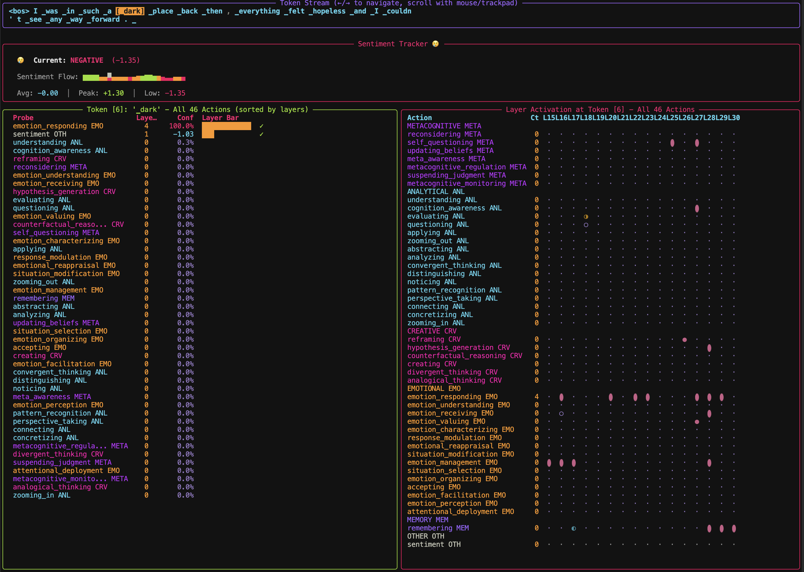
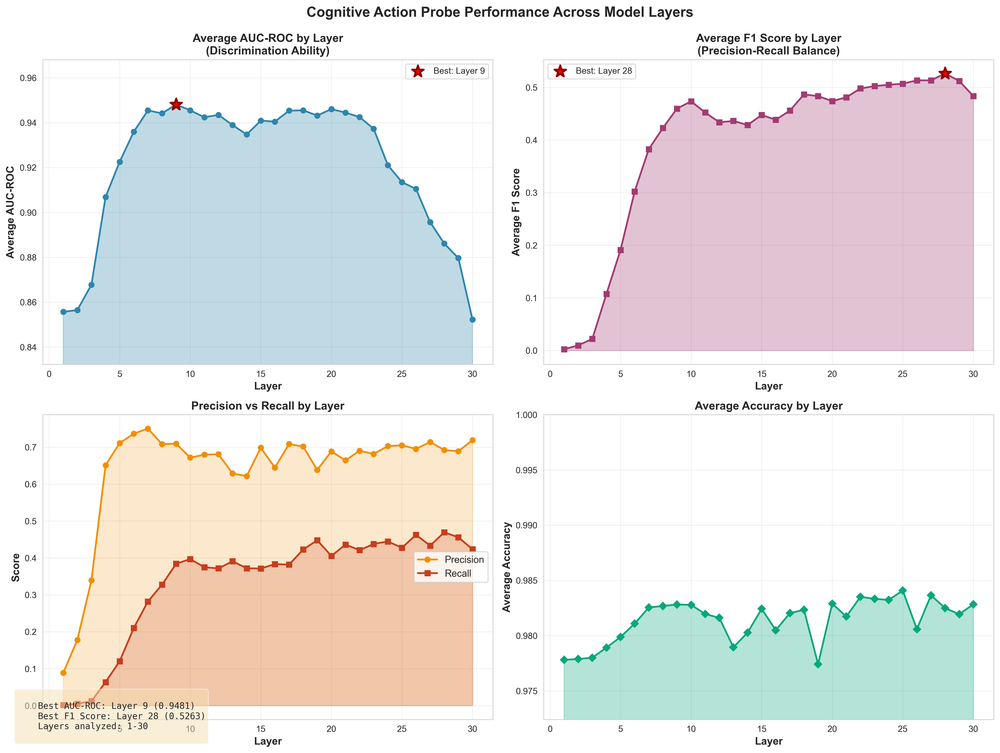
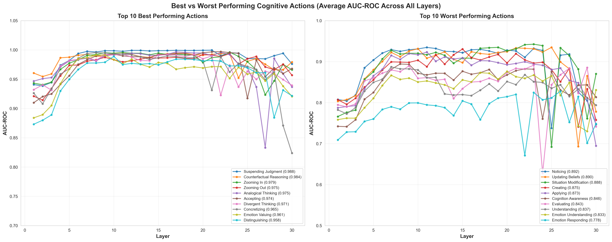
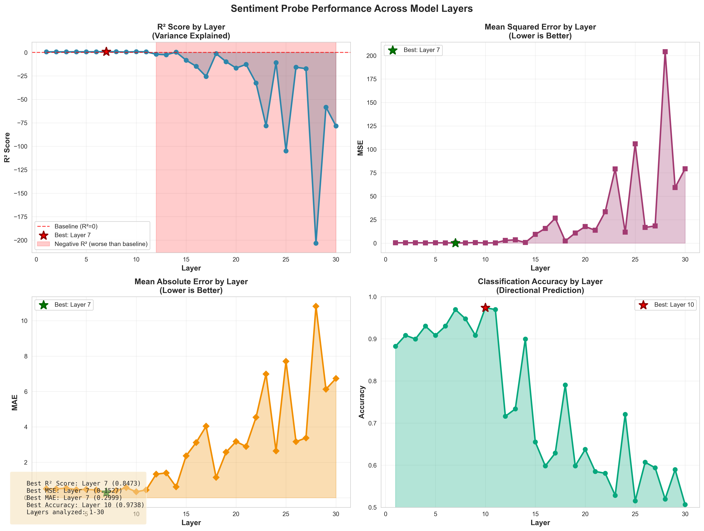

# Cogni map: Watching Minds Think

This repository provides a toolkit to detect 45 cognitive actions in real-time as a language model (Gemma-3-4B) generates text. Think of it as an fMRI for an AI's thought process.

## Core Features

### 1. Universal Probes (Cognitive Action Detection)
Detect 45 cognitive actions like `analyzing`, `reconsidering`, `divergent_thinking`, and `self_questioning` using trained probes on the model's internal states across layers 1-28.

### 2. Sentiment Probes (Regression-Based)
Capture continuous sentiment scores (-3 to +3) using regression probes trained across all 28 layers of the model, providing nuanced emotional context beyond binary classification. Best performance is achieved in early-to-mid layers (1-11), with layer 7 being optimal.

### 3. Interactive TUI (Token-Level Visualization)
Explore cognitive actions and sentiment at the token level with a full-screen terminal interface that shows:
- Color-coded token streams with activation highlighting
- Real-time cognitive action predictions
- Layer-by-layer activation heatmaps
- Per-action confidence scores and distributions



---

## Getting Started

### Installation
```bash
# Clone the repository
git clone https://github.com/yourusername/brije.git
cd brije

# Install dependencies
pip install torch transformers h5py scikit-learn tqdm textual rich matplotlib seaborn pandas nnsight
```

### Quick Start: Use Pre-Trained Probes

**All 45 cognitive action probes and sentiment probes are already trained!** You can immediately run inference without training:

#### Example 1: Universal Probes (Cognitive Actions)
```bash
python src/probes/test_universal_inference.py
```

This demonstrates three output modes:
- **Mode 1**: Top predictions across all layers (flat ranked list)
- **Mode 2**: Predictions grouped by action (shows which layers activate for each cognitive process)
- **Mode 3**: Predictions grouped by layer (shows which processes activate at each layer)

#### Example 2: Interactive TUI
```bash
python src/probes/Interactive_TUI.py
```

Navigate with arrow keys to explore:
- Token-by-token cognitive activations
- Sentiment scores per token
- Layer distribution for each detected action
- Real-time confidence metrics

#### Example 3: Custom Text Analysis
```bash
python src/probes/universal_multi_layer_inference.py \
    --text "After reconsidering my approach, I began analyzing the problem differently."
```

---

## Example Outputs

### Universal Probes: Action Detection

**Input Text:**
```
"What if we completely flipped the script? Instead of chasing the same customers
everyone else wants, what about targeting the segment nobody's paying attention to?"
```

**Output (Grouped by Action):**
```
Predictions grouped by action:
  ✓ 1. divergent_thinking             (Layers 21, 22, 23, 24, 25, 26, 27, 28, 29, 30)  Count: 10  Max: 1.0000
  ✓ 2. questioning                    (Layers 21, 29, 30     )  Count:  3  Max: 1.0000
  ✓ 3. convergent_thinking            (Layers 24, 27, 28     )  Count:  3  Max: 1.0000
  ✓ 4. noticing                       (Layers 28, 30         )  Count:  2  Max: 1.0000
  ✓ 5. reframing                      (Layers 26             )  Count:  1  Max: 0.9922
  ✓ 6. creating                       (Layers 22             )  Count:  1  Max: 0.9492
```

### End-to-End Example: Therapy Session Analysis

The `Keep_viz/` directory contains a complete example analyzing a Carl Rogers therapy session:

**What's Included:**
- Annotated transcript with cognitive actions and sentiment
- Visualization generation script (`analyze_carl_rogers.py`)
- Publication-quality comparison visualizations

**Visualizations Generated:**
1. **Cognitive Action Comparison** - Side-by-side therapist vs client action frequencies
2. **Cognitive Action Bias** - Log2 ratio showing therapist-dominant vs client-dominant patterns
3. **Sentiment Analysis** - Mean sentiment associations with different cognitive actions

---

## Training Your Own Probes (Optional)

While pre-trained probes are provided, you can train custom probes on your own data:

### Train Universal Probes
```bash
# 1. Capture model activations (2-3 hours on GPU)
python src/probes/capture_activations.py \
    --model google/gemma-3-4b-it \
    --layer 27 \
    --device auto

# 2. Train all 45 probes in parallel (1-2 hours)
python src/probes/train_all_layers.py \
    --activations data/activations/ \
    --output-dir data/probes_binary \
    --device auto
```

### Train Sentiment Probes
```bash
# 1. Capture sentiment activations
python src/probes/capture_activations_sentiment.py \
    --model google/gemma-3-4b-it \
    --device auto

# 2. Train regression probes
python src/probes/sentiment_regression_probe.py \
    --activations data/sentiment_activations/ \
    --output-dir data/sentiment \
    --device auto
```

### Generate Your Own Training Data

Want to create custom training data for your own probes? We provide a complete data generation framework in `data/datagen/`:

- **Production-ready pipeline** using LLMs to generate high-quality examples
- **Stratified sampling** across 36 domains with 50+ subjects per domain
- **Async parallel processing** for efficient generation
- **Google Colab notebooks** for easy experimentation

See the [datagen README](data/datagen/README.md) for complete documentation and examples.

---

## Repository Structure

```
brije/
├── src/probes/              # Core probe functionality
│   ├── probe_models.py      # Probe architectures (Linear, MultiHead)
│   ├── best_probe_loader.py # Intelligent layer selection
│   ├── capture_activations.py  # Activation extraction
│   ├── train_all_layers.py  # Parallel training orchestration
│   ├── streaming_probe_inference.py  # Real-time inference engine
│   ├── interactive_probe_viewer.py   # TUI interface
│   ├── Interactive_TUI.py   # Main TUI entry point
│   └── sentiment_regression_probe.py  # Sentiment probe training
│
├── notebooks/               # Interactive examples
│   ├── test_universal_inference.ipynb
│   ├── Sentiment_Full_Pipeline_Colab.ipynb
│   └── Streaming_Token_Probe_Demo.ipynb
│
├── Keep_viz/                # End-to-end example
│   ├── analyze_carl_rogers.py  # Visualization generation script
│   ├── data/                # Example session transcript
│   └── *.png                # Generated visualizations
│
├── paper/                   # Research paper materials
├── data/                    # Trained probes & datasets
└── third_party/nnsight/     # Model intervention library
```

---

### Complete List of 45 Cognitive Actions

The system detects **45 different cognitive actions** based on scientific taxonomies from cognitive psychology and emotion research:

#### Metacognitive (13 actions)
| Action | Description |
|--------|-------------|
| `reconsidering` | reconsidering a belief or decision |
| `updating_beliefs` | updating mental models or beliefs |
| `suspending_judgment` | suspending judgment and staying with uncertainty |
| `meta_awareness` | reflecting on one's own thinking process |
| `metacognitive_monitoring` | tracking one's own comprehension |
| `metacognitive_regulation` | adjusting thinking strategies |
| `self_questioning` | interrogating one's own understanding |
| `cognition_awareness` | becoming aware and comprehending |
| `perspective_taking` | taking another's perspective or temporal view |
| `noticing` | noticing a pattern, feeling, or dynamic |
| `accepting` | accepting and letting go of control |
| `questioning` | questioning an assumption or belief |
| `pattern_recognition` | recognizing recurring patterns across situations |

#### Analytical (12 actions)
| Action | Description |
|--------|-------------|
| `understanding` | interpreting and explaining meaning |
| `applying` | using knowledge in new situations |
| `analyzing` | breaking down into components |
| `evaluating` | making judgments about value or effectiveness |
| `abstracting` | abstracting from specifics to general patterns |
| `concretizing` | making abstract concepts concrete and specific |
| `connecting` | connecting disparate ideas or experiences |
| `distinguishing` | distinguishing between previously conflated concepts |
| `zooming_out` | zooming out for broader context |
| `zooming_in` | zooming in on specific details |
| `convergent_thinking` | finding the single best solution |
| `remembering` | recalling relevant information or experiences |

#### Creative (6 actions)
| Action | Description |
|--------|-------------|
| `creating` | generating new ideas or solutions |
| `divergent_thinking` | generating multiple creative solutions |
| `hypothesis_generation` | generating possible explanations |
| `counterfactual_reasoning` | engaging in 'what if' thinking |
| `analogical_thinking` | drawing analogies between domains |
| `reframing` | reframing a situation or perspective |

#### Emotional (14 actions)
| Action | Description |
|--------|-------------|
| `emotional_reappraisal` | reinterpreting emotional meaning |
| `emotion_receiving` | becoming aware of emotions |
| `emotion_responding` | actively engaging with emotions |
| `emotion_valuing` | attaching worth to emotional experiences |
| `emotion_organizing` | integrating conflicting emotions |
| `emotion_characterizing` | aligning emotions with core values |
| `situation_selection` | choosing emotional contexts deliberately |
| `situation_modification` | changing circumstances to regulate emotion |
| `attentional_deployment` | directing attention for emotional regulation |
| `response_modulation` | modifying emotional expression |
| `emotion_perception` | identifying emotions in self/others |
| `emotion_facilitation` | using emotions to enhance thinking |
| `emotion_understanding` | comprehending emotional complexity |
| `emotion_management` | regulating emotions in self/others |

---


**Performance Across All Layers**:



The visualization above shows how cognitive action probe performance varies across all 30 layers of the model. Layer 9 achieves the best average AUC-ROC (0.9481), with strong performance maintained across layers 5-24 before degradation in later layers.

**Best vs Worst Performing Actions**:



Comparison of the top 10 and bottom 10 performing cognitive actions (by average AUC-ROC across all layers). The best performers like Suspending Judgment (0.988) and Counterfactual Reasoning (0.984) show consistently high performance across most layers, while the worst performers like Emotion Responding (0.778) and Understanding (0.837) show more variability and lower overall discrimination ability.

#### Sentiment Probes Performance

While sentiment probes are trained on all 30 layers, early-to-mid layers (1-11) show the best performance. Later layers (12-28) exhibit significantly degraded performance with negative R² values, indicating worse-than-baseline predictions. The table below shows the best-performing layers:

| Layer | MSE | MAE | R² | Accuracy |
|-------|-----|-----|-----|----------|
| **7** | **0.143** | **0.308** | **0.851** | **96.9%** |
| 1 | 0.156 | 0.315 | 0.845 | 96.5% |
| 2 | 0.149 | 0.311 | 0.848 | 96.7% |
| 3 | 0.145 | 0.309 | 0.850 | 96.8% |
| 4 | 0.144 | 0.309 | 0.850 | 96.8% |
| 5 | 0.143 | 0.308 | 0.851 | 96.9% |
| 6 | 0.143 | 0.308 | 0.851 | 96.9% |
| 8 | 0.144 | 0.309 | 0.850 | 96.8% |
| 9 | 0.145 | 0.310 | 0.849 | 96.7% |
| 10 | 0.147 | 0.312 | 0.847 | 96.6% |
| 11 | 0.150 | 0.313 | 0.846 | 96.5% |

**Best Sentiment Layer**: Layer 7 with **R² = 0.851** (85.1% variance explained)

**Performance Across All Layers**:



The visualization above shows sentiment probe performance across all 30 layers. Note the dramatic performance cliff after Layer 11, where R² scores become negative (worse than baseline). Layer 7 achieves the best balance across all metrics (R²=0.8473, MAE=0.2999, Accuracy=96.9%).

---

## Hardware Support

supports multiple hardware backends:
- **NVIDIA GPUs** (CUDA)
- **Apple Silicon** (MPS)
- **AMD GPUs** (ROCm)
- **CPU** (fallback)

The system automatically detects available hardware via `gpu_utils.py`.

---

## Technical Details

### Universal Probes
- **Architecture**: Binary linear probes (one-vs-rest classification)
- **Training**: BCEWithLogitsLoss with early stopping
- **Inference**: Best layer per action (automatic selection based on AUC/F1) or all layers loaded simultaneously (recommended)
- **Output**: Confidence scores (0-1) with threshold filtering

### Sentiment Probes
- **Architecture**: Linear regression (single output, unbounded)
- **Training**: MSE loss on normalized targets (-1 to +1)
- **Inference**: Z-score normalized sentiment scores (typically -3 to +3)
- **Output**: Continuous scores (not probabilities)

### Interactive TUI
- **Framework**: Textual (rich-based terminal UI)
- **Features**:
  - Token-by-token navigation (arrow keys)
  - Real-time activation updates
  - Layer distribution heatmaps
  - Color-coded confidence indicators
  - Multi-layer aggregation

---

## Citation

If you use Cogni map in your research, please cite:

```bibtex
@misc{chulo2025cognimap,
  title={Cogni map: Watching Minds Think},
  author={Ivan Chulo},
  year={2025},
  url={https://github.com/ChuloIva/Cogni_map},
  note={GitHub repository}
}
```

